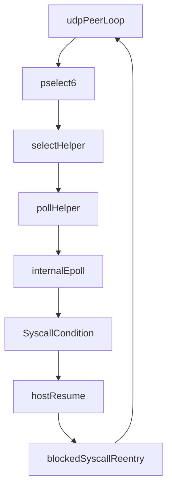

# Multihost 网络恢复问题报告

## 终极目标
目标不是“restore 后进程没崩”，而是让 `tests/checkpoint-network-multihost` 中的网络通信在 checkpoint/restore 前后保持语义连续。

- TCP 目标：既有连接继续推进 `seq/ack`，不依赖应用层重连。
- UDP 目标：`udp_peer_a` 与 `udp_peer_b` 在 restore 后继续稳定产生 `udp_tx/udp_rx`。
- 工程目标：主要在 Shadow 一侧补齐状态采集与恢复，而不是把语义恢复外包给测试程序。

## Highlevel 直觉模型
这类问题不是单纯的 CRIU 问题，也不是单纯的 Shadow socket 问题，而是三层状态必须重新对齐：

1. CRIU 恢复原生进程、线程、用户态内存。
2. Shadow 恢复模拟器内部对象，例如描述符表、socket、事件队列、阻塞条件。
3. shim 与 Shadow 在 restore 后重新接上“当前线程正在执行哪个 syscall、为什么阻塞、何时继续”的运行时握手。

TCP 更偏向“连接对象状态机恢复”。
UDP 这次剩余问题更偏向“阻塞中的 syscall 恢复协议”。

## 当前结论
当前问题已经收敛成两个层面：

- TCP：对象级恢复已基本打通。
- UDP：仍卡在 `pselect6 -> select -> poll -> internal epoll` 这条阻塞链的 restore 协议上。

测试目标和验收逻辑定义在：

- `tests/checkpoint-network-multihost/README.md`
- `tests/checkpoint-network-multihost/orchestrator_verify.py`
- `tests/checkpoint-network-multihost/net_app.py`

其中 UDP 测试程序每秒发一次包，并在 0.2s 粒度上调用 `select.select([sock], [], [], min(left, 0.2))` 等待可读事件或超时。

## TCP 已经做到了什么
### 已落地能力
下面这些路径已经把 TCP 从“描述符外观恢复”推进到“对象级运行态恢复”：

- `src/main/core/checkpoint/snapshot_types.rs`
- `src/main/host/process.rs`
- `src/main/host/descriptor/socket/inet/legacy_tcp.rs`
- `src/main/host/descriptor/tcp.c`
- `src/main/host/descriptor/tcp.h`

已经补上的关键能力包括：

- `DescriptorEntrySnapshot.socket_runtime`
- `SocketRuntimeSnapshot::LegacyTcp`
- `LegacyTcpSocketRuntimeSnapshot`
- `tcp_getRestoreState`
- `tcp_restoreListenerState`
- `tcp_restoreEstablishedState`
- `LegacyTcpSocket::runtime_snapshot`
- `LegacyTcpSocket::restore_runtime`

### 当前效果
双回归门禁里：

- `tests/checkpoint-multihost/orchestrator_repl.py` 稳定通过。
- `tests/checkpoint-network-multihost/orchestrator_verify.py` 中，TCP 已不再出现 `ENOTCONN`、reconnect churn、重新 accept 抖动。

实际现象是 restore 后 `tcp_client` 能继续推进 `tcp_tx`/`tcp_rx_ack`，说明既有连接已经能透明续跑。

## UDP 剩余问题是什么
### 不是 socket 外观问题
当前 UDP socket 的描述符和 runtime 已经进入 checkpoint：

- `src/main/host/process.rs` 会采集 `SocketRuntimeSnapshot::Udp`
- restore 时也会重建 UDP socket 并应用 runtime

因此，UDP 失败不再像早期那样是“socket 没建出来”。

### 是 blocked syscall 语义没有恢复完整
当前测试里，UDP 线程阻塞在：

- Python `select.select`
- Shadow `pselect6`
- `src/main/host/syscall/handler/select.c`
- `src/main/host/syscall/handler/poll.c`
- `SyscallHandler` 自带的 internal epoll

这条链意味着线程在 checkpoint 时保存的不只是一个“UDP socket”，而是一个“正在执行中的、已阻塞的 poll-family syscall”。

真正要恢复的是：

- 当前在等哪些 fd
- 等待读/写哪类事件
- timeout 的绝对时刻
- internal epoll 的 watch 集合
- Shadow/shim 对“这是同一个 blocked syscall”的握手状态
- timeout 到期或事件到达后，syscall 应该如何返回给用户态

如果只恢复 socket，而不恢复这条阻塞协议，线程就可能永久停在 restore 前的等待点。

## 已经做过哪些努力
### 1. 线程阻塞运行态快照
在 `src/main/core/checkpoint/snapshot_types.rs` 与 `src/main/core/manager.rs` 中，已经补了：

- `blocked_timeout_ns`
- `blocked_trigger_fd`
- `blocked_trigger_state_bits`
- `blocked_active_file_fd`
- `poll_watches`

`poll_watches` 由 `snapshot_poll_watches()` 从 live 进程内存中读出：

- `poll/ppoll` 读取 `pollfd[]`
- `select/pselect6` 读取 `fd_set`

并统一映射到恢复 internal epoll 所需的 watcher 集合。

### 2. 恢复 internal epoll watch
在：

- `src/main/host/syscall/handler/mod.rs`
- `src/main/host/thread.rs`

中已经补了：

- `SyscallHandler::restore_poll_watchers`
- `Thread::restore_poll_blocked_syscall_condition`

即：restore 时先重建 handler 内部 epoll 的 watch 集合，再尝试恢复阻塞条件。

### 3. 调整 restore 时序
在 `src/main/core/manager.rs` 中，已经试过：

- 把阻塞条件恢复任务放到 `replay_time + 1ns`
- 调整 `resume_time`
- 调整 `nudge_count`
- 针对 poll runtime 保留少量兼容 nudge

这些尝试都没有让 UDP 恢复出 `udp_tx/udp_rx`。

### 4. 处理 shim/Shadow 陈旧握手
在 `src/main/host/managed_thread.rs` 中，已经有：

- `force_syscall_eintr_once`

用于在 restore 后首次 syscall 上做一次 synthetic completion，试图打破陈旧阻塞握手。

但对 UDP 这条链来说，这仍然不够稳定。

## 现在掌握的证据
### 证据 1：TCP 已恢复，UDP 没恢复
这说明当前问题不是“整个 restore 流程没工作”，而是剩余问题已经缩小到 UDP/pselect 路径。

### 证据 2：checkpoint 里已经有 poll watch
`cp_network_verify.checkpoint.json` 中可以看到 UDP 线程的 runtime 含有：

- `blocked_syscall_nr = 270`（即 `pselect6`）
- `blocked_timeout_ns`
- `poll_watches = [{ fd: 3, epoll_events: 1 }]`

这说明 checkpoint 侧至少已经能拿到“线程当时在等 UDP fd=3 可读”这条信息。

### 证据 3：restore 后 UDP 日志没有继续追加
restore 后：

- TCP 的日志会继续增长
- UDP 的 `python3.10.1001.stdout` 不再追加新的 `udp_tx/udp_rx`

这说明 UDP 线程没有重新回到用户态外层心跳循环。

### 证据 4：诊断里线程长期停在 `futex_wait_queue`
这进一步说明问题更接近：

- 线程仍停在 shim/Shadow 阻塞握手中
- 而不是单纯“socket 没数据”

## 目前最合理的技术判断
当前最可能的缺口不是“watch 集合还不够”，而是：

`pselect/poll` 这类 blocked syscall 的返回协议仍未被完整恢复。

更具体地说，缺的可能是下面这些状态中的一部分：

- timeout 到期后 handler 的再判定路径
- blocked syscall 首次重入时依赖的内部状态
- 返回用户态前的写回上下文，例如 `fd_set` / `pollfd.revents`
- Shadow 与 shim 对“这次 resume 是恢复同一个 blocked syscall 还是重新发起一次 syscall”的同步

也就是说：

- TCP 剩余问题曾经主要是“对象状态机”
- UDP 现在主要是“阻塞恢复协议”

## 为什么这个问题难
因为 restore 面对的不是一个静态对象，而是一个“执行到一半的动态协议”。

对于 UDP 测试来说，应用层代码看起来只是：

- `sendto`
- `select.select`
- `recvfrom`

但在 Shadow 内部，这个 `select.select` 已经被展开成：

只恢复 `internalEpoll` 或 `SyscallCondition` 中的一部分状态，不等于整条链重新闭合。

## 我们已经从这个问题中学到了什么
- “恢复网络状态”不能只看 socket。
- “恢复 blocked syscall”不能只看 timeout。
- “恢复等待对象”也不等于“恢复用户态可继续推进”。
- 需要把 checkpoint/restore 视为对运行中协议的快照，而不是对孤立对象的 dump/load。

## 建议的下一步
下一步不应继续泛化地“补更多 socket 信息”，而应聚焦：

1. 明确 `pselect6` 在 restore 后第一次重入时依赖哪些额外状态。
2. 确认 `did_listen_timeout_expire()` 与 `blocked_syscall` 的配合是否足够让 handler 正确返回。
3. 评估是否需要把 `pselect/poll` 的 checkpoint 从“等待对象快照”升级成“等待对象 + blocked syscall 返回协议快照”。

## 当前工程状态总结
- TCP：基本收敛，可视为对象级恢复已打通。
- UDP：问题已高度收敛，剩余 blocker 集中在 poll-family blocked syscall restore protocol。
- 工程方向：继续坚持 snapshot-first，但对 UDP 要从“socket runtime”切换到“blocked syscall runtime”视角。
